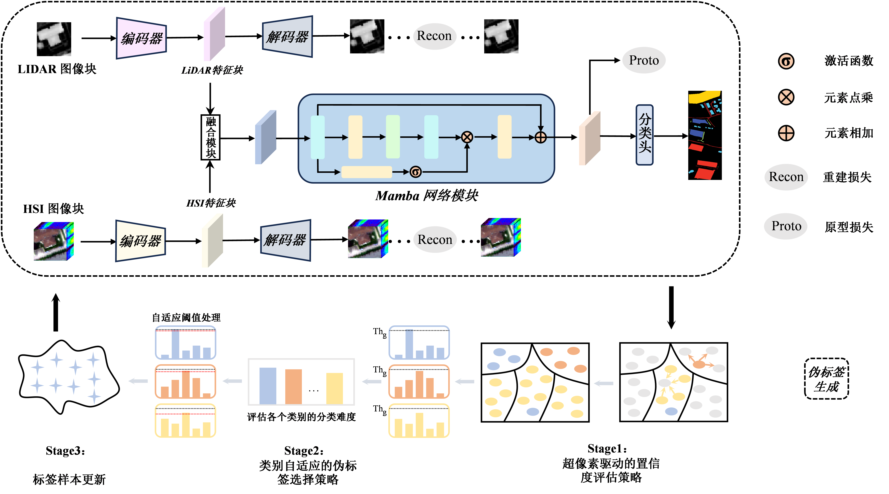

# SGFA
## Superpixel-Guided Semi-Supervised Feature-Aware Fusion Network

## 🧠 Introduction

<p align="center">
  
</p>

**This paper proposes a Superpixel-Guided Semi-supervised Feature Fusion Classification Network (SGFA). The proposed method leverages superpixel segmentation to construct regional constraints, designs a multi-metric fusion confidence evaluation mechanism, and achieves cross-modal feature alignment through class prototype memory.**

**The main contributions are summarized as follows:**

**Superpixel-guided pseudo-label confidence evaluation mechanism (SPCM) is proposed to improve the quality of unlabeled sample utilization. Hierarchical superpixel units are constructed in the feature space of unlabeled samples, where sample confidence is jointly evaluated through intra-group structural consistency and inter-group feature similarity. This effectively suppresses error propagation of noisy labels and enhances the robustness of pseudo-label generation.**

**A class-adaptive pseudo-label selection strategy (CCS) is introduced to prioritize high-information samples near the decision boundary. Meanwhile, a class-adaptive thresholding mechanism is designed to alleviate class imbalance, thereby improving pseudo-label utilization efficiency and reducing the risk of error propagation.**

**A multi-level loss-guided feature constraint module (MLFC) is developed. By jointly incorporating class prototype constraints and deep feature reconstruction, the proposed module enhances intra-class compactness and cross-modal consistency, enabling robust multimodal feature representation under limited supervision.**

## 🛠️ Environment
```
pip3 install -r requirements.txt
```

## 🌟 Datasets
Get the disjoint dataset (Trento11x11 folder) from [Google Drive](https://drive.google.com/drive/folders/1HK3eL3loI4Wd-RFr1psLLmVLTVDLctGd?usp=sharing).

Get the disjoint dataset (Houston11x11 folder) from [Google Drive](https://drive.google.com/drive/folders/1OnLkDpqMtNJy0DRS6YsKKbSqQiiUSgro?usp=sharing)

Get the disjoint dataset (MUUFL11x11 folder) from [Google Drive](https://drive.google.com/drive/folders/1oTUAE3QiVb80sFNi6rvHukFTfZn-lJR_?usp=sharing)

## 📌 Structure

```
├── Data
│ └── <dataset_name>
│    └── ...
├── src
│ └── demo.py  
│ ...
```

